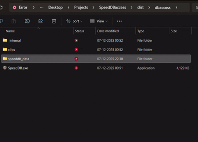
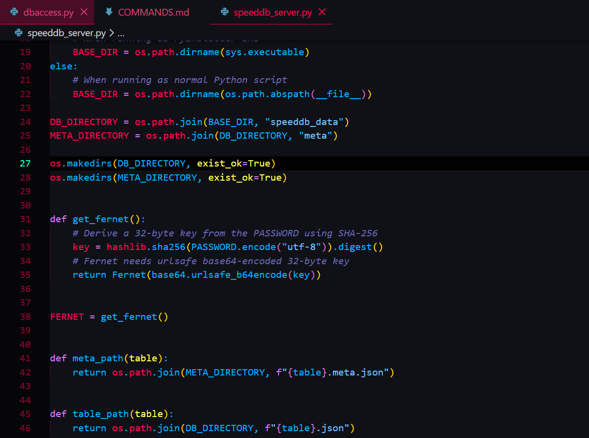
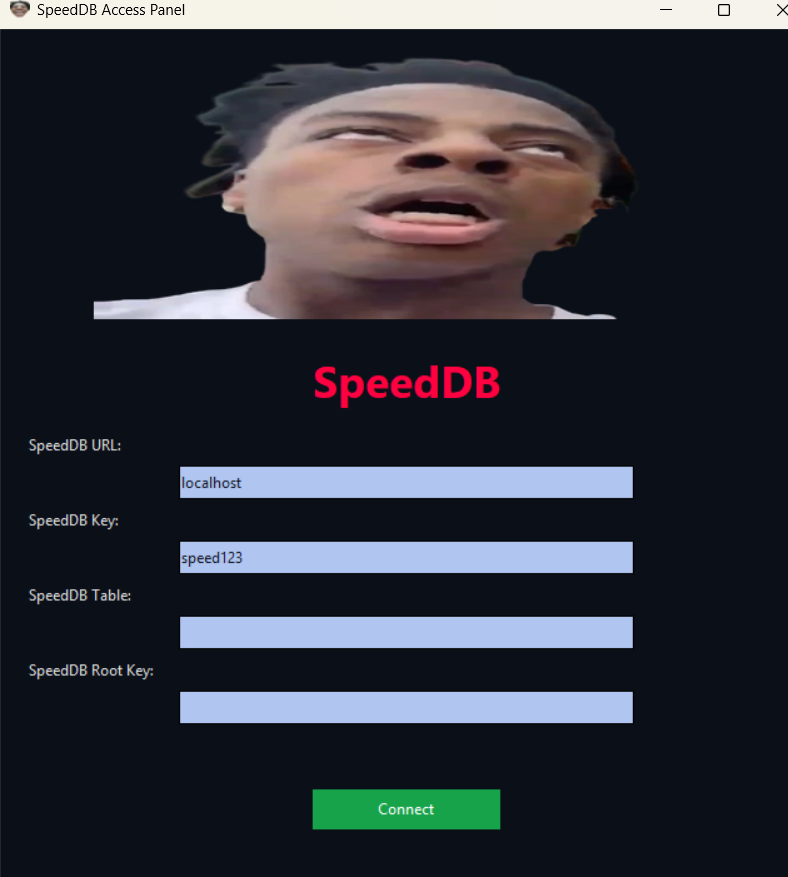
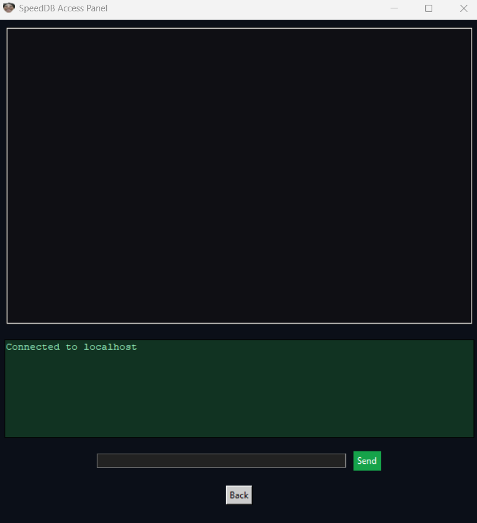
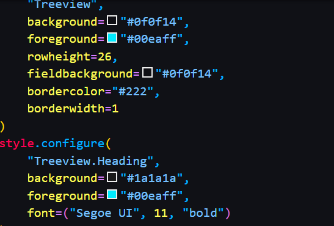
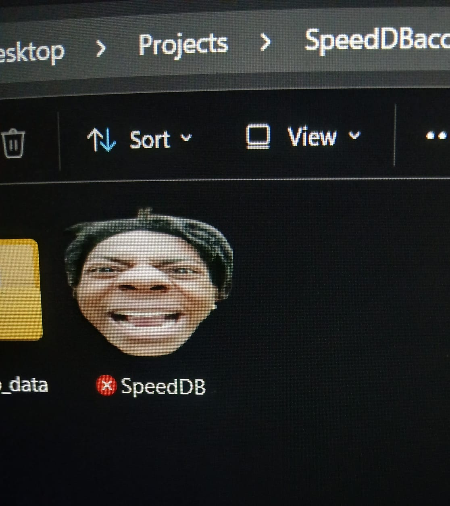
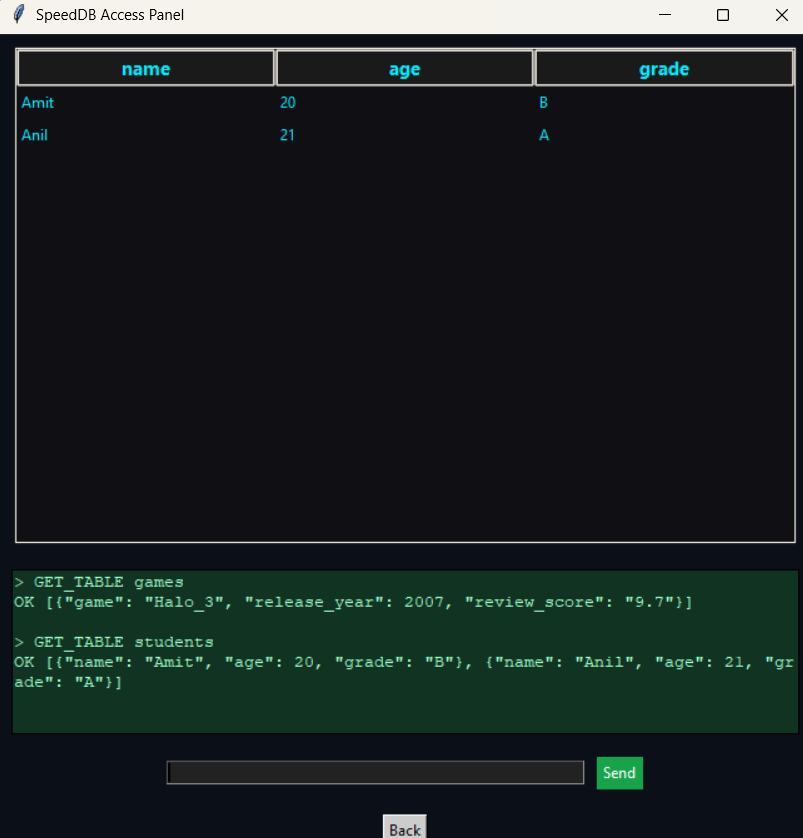
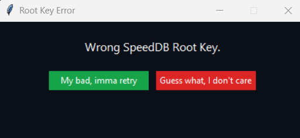

# **SpeedDB — Encrypted TCP Mini-Database With a Chaotic GUI**

*A dangerously over-engineered student project featuring encryption, sockets, custom GUI, packaged EXE, and IShowSpeed yelling at your errors.*


---

## 🚀 **Overview**

**SpeedDB** is a fully custom, encrypted, file-based database system built from scratch using:

* **Python sockets** (TCP server)
* **Custom command protocol**
* **Fernet encryption**
* **Tkinter GUI client**
* **Threading**
* **PyInstaller packaging**
* **python-vlc media integration**


This project simulates a real database engine — but with the unhinged twist of playing IShowSpeed videos and screams whenever a user messes up a command.

It started as a simple college project.
It ended as a psychological horror database engine.

---

# 🧠 **Architecture**

```
┌────────────────────┐
│   SpeedDB Client   │  ← GUI, Videos, Audio, Commands
│    dbaccess.py     │
└─────────┬──────────┘
          │  TCP (port 6969)
          ▼
┌────────────────────┐
│  SpeedDB Server    │  ← Encryption, Storage Engine
│ speeddb_server.py  │
└─────────┬──────────┘
          ▼
   Encrypted JSON Tables
   /speeddb_data/*.json
```

---

# ⚙️ **Tech Stack**

| Component         | Technology               | Purpose                           |
| ----------------- | ------------------------ | --------------------------------- |
| **Language**      | Python 3.10              | Primary runtime                   |
| **GUI**           | Tkinter                  | Multi-screen desktop UI           |
| **Media Engine**  | python-vlc               | Plays videos & audio in reactions |
| **Encryption**    | cryptography (Fernet)    | Encrypts table files              |
| **File Handling** | JSON + Fernet ciphertext | Encrypted DB storage              |
| **Server**        | Python sockets           | Handles AUTH, GET, INSERT, DELETE |
| **Threading**     | `threading.Thread`       | Runs server in background         |
| **Build System**  | PyInstaller              | Creates Windows `.exe`            |
| **Images**        | Pillow (PIL)             | Image loading & resizing          |


---

# 🔐 **Encryption Model**

SpeedDB encrypts every table using:

```
Fernet( base64.urlsafe_b64encode( SHA256(PASSWORD) ) )
```

This provides:

* AES-128 CBC + HMAC security
* Encrypted data-at-rest
* No readable plaintext on disk
* Key derived from a static password for reproducible decryption

Opening a `.json` table manually shows only ciphertext like:

```
gAAAAABl2W0IY7n3uEo4rQ...
```

---

# 📦 **Running SpeedDB**

### ✔ Run From Source

Install dependencies:

```bash
pip install pillow python-vlc cryptography
```

Start the GUI client (starts server automatically):

```bash
python dbaccess.py
```


---

### ✔ Build Windows Executable

Use PyInstaller:

```bash
pyinstaller --windowed --add-data "clips;clips" --icon="speed_icon.ico" dbaccess.py
```

Output appears at:

```
dist/dbaccess/
```

Run `dbaccess.exe` from anywhere.

---

# 🎛️ **GUI Features**

### Login Screen



* Speed face banner
* Fields for:

  * URL
  * DB Key
  * Table
  * Root Key
* Enter key binds for smooth UX
* Wrong root key → Speed video jumpscare

### Data Viewer

* Table loaded from server
* Scrollable row display
* Command input box
* Integrated console output
* Speed screams on errors





---

# 🧪 **Command Reference**

| Command                              | Description               |
| ------------------------------------ | ------------------------- |
| `AUTH user password`                 | Authenticate to server    |
| `LIST_TABLES`                        | Show all tables           |
| `CREATE_TABLE name col1 col2 ...`    | Create table with columns |
| `GET_TABLE name`                     | Fetch rows                |
| `INSERT table {json}`                | Insert JSON row           |
| `DELETE_ROW table WHERE key="value"` | Delete rows by condition  |
| `HELP`                               | Show command list         |

---

# 🎞️ **Media System**

SpeedDB supports custom:

* Video clips
* Audio clips
* Static PNG/JPEG images


### Folder Structure

```
clips/
    speed_mad1.mp4
    speed_mad2.mp4
    ...
    speed_face.png
    audio/
         bark.mp3
         scream.mp3
         ...
```

### Add Your Own Clips

To replace or add new media, simply drop files into:

```
clips/
clips/audio/
```

Then update the lists in `dbaccess.py`:

```python
SPEED_MAD_CLIPS = [
    os.path.join(CLIPS_DIR, "your_clip.mp4"),
]
```

### Custom App Icon

Replace `speed_icon.ico` → rebuild → enjoy new branding.




---

# 🧩 **Internal Server Behavior**

SpeedDB server (`speeddb_server.py`):

* Listens on `0.0.0.0:6969`
* Spawns new threads for each client
* Validates authentication
* Loads / decrypts / updates JSON tables
* Writes encrypted blobs back to disk
* Handles malformed input gracefully (usually)



---

# 💡 **Why This Project Exists**

Because:

* college projects are boring
* databases shouldn’t be
* socket servers are fun
* encryption makes anything cooler
* and Speed yelling at your errors builds character

This project shows:

* understanding of **systems programming**
* custom protocol design
* socket networking
* data encryption
* GUI development
* packaging & distribution
* asynchronous architecture
* media integration
* engineering chaos

DSA recruiters will NOT understand this.
Real engineers WILL.



---

# ⭐ **Support This Madness**

If SpeedDB emotionally damaged you or impressed you, consider leaving a star on the repo.

It helps my sanity grow back. Probably. Please ... I need a job. My crippling soda and momo cravings has financially ruined me. The begging for a start isn't a request , it's a cry for help. 


# ⚠️ **Current Limitations (Short Version)**

SpeedDB is an experimental student-built database and GUI client.
It works, it’s fun, but it’s intentionally *simple*.
Here are the major limitations you should know:

---

### **🔹 1. Limited Command Set**

Only supports:

* AUTH
* LIST_TABLES
* CREATE_TABLE
* GET_TABLE
* INSERT
* DELETE_ROW
* DROP_TABLE

No SQL syntax, no UPDATE, no JOINs, no ORDER BY.

---

### **🔹 2. Minimal Query Logic**

`WHERE` only supports simple:

```
WHERE key = "value"
```

No operators, no AND/OR, no advanced filtering.

---

### **🔹 3. Basic Encryption**

Data at rest **is encrypted**, but:

* Password transmitted in plaintext
* No SSL/TLS
* No rotating keys

Good for local use, **not** production.

---

### **🔹 4. File-Based Storage**

Tables are:

* JSON lists (encrypted)
* Loaded fully into memory
* Written back fully on save

This means no indexing, no pagination, no optimizations.

---

### **🔹 5. No Concurrency Control**

Server is multi-threaded but:

* No row/table locking
* No transactions
* Last write wins

Works fine for light, local testing.

---

### **🔹 6. Simple Authentication**

One shared password.
No user system, no roles, no audit logging.

---

### **🔹 7. Not a Production Database**

Missing:

* Cloud deployment support
* Backups/snapshots
* Schemas or type validation
* Binary/BLOB storage
* Installer / auto-updater

This project is meant for **learning**, not enterprise workloads.

---

### **🔹 8. GUI Limitations**

Client GUI:

* Displays tables
* Sends raw commands
* Doesn't edit/modify data directly
* Requires user knowledge of command syntax

---

### **🔹 9. No Testing Framework Yet**

There are no unit tests, integration tests, or CI pipeline.


**SpeedDB is a fun encrypted JSON-based toy database with a chaotic GUI.
It’s intentionally lightweight, hackable, and experimental — perfect for learning sockets, encryption, PyInstaller, GUI building, and client-server architecture. But it has it's limit and is not a commercially viable project , just a vibe coded student project to showcase actual DBMS and Software Engineering learnings. Use SpeedDB to your heart's content and feel free to modify and change or improve or add or remove features as per your wishes.**
